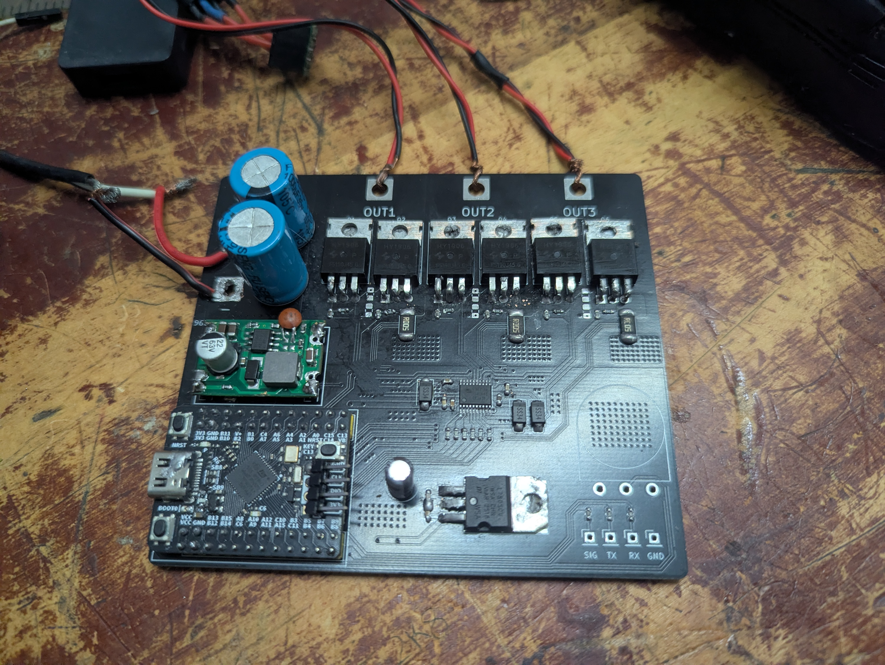

# Vortex FOC

**Sensorless Field Oriented Control (FOC) for PMSM & BLDC Motors**  
*Optimized for STM32G431 microcontrollers — featuring configurable 24 kHz to 64 kHz CCMRAM execution, Self-Tuning Filter SMO, LADRC speed control, and a real-time Python desktop configurator.*

---

[](https://www.youtube.com/watch?v=LBecr3bSMa8)

[](https://www.st.com/en/microcontrollers-microprocessors/stm32g431kb.html)
[]()
[](Tools/Configurator/)
[](LICENSE)

---

## Highlights

- **24 kHz to 64 kHz Current Loop (~10.5 µs compute time)**: Configurable PWM and control loop frequency running entirely in STM32 CCMRAM for zero-wait-state execution, utilizing hardware CORDIC math and simultaneous dual injected ADC conversions.
- **Continuous STF-SMO with Fastmoid & Auto-Gains**: Ultra-fast algebraic sigmoid running in 3 FPU cycles with real-time 1 kHz adaptation of sliding gain `k_slide` and boundary layer `k_sigmoid`, combined with a Self-Tuning Filter (STF) for zero phase-lag BEMF filtering.
- **6th-Order Harmonic Rejection**: Online LMS adaptive filter eliminates inverter dead-time distortion and motor cogging ripple from the estimated rotor angle.
- **LADRC Speed Controller**: Linear Active Disturbance Rejection Control with a 2nd-order LESO, actively estimating and rejecting aerodynamic drag, load step torque, and voltage droop in real time.
- **Dynamic 3-Phase Skipping**: Low-side 3-shunt sensing automatically skips the phase with the highest duty cycle, eliminating narrow-pulse sampling errors and extending maximum modulation index.
- **Shockless Flying Start & Reverse Braking**: Seamlessly catches spinning propellers with inverse-sigmoid observer pre-seeding; recovers reverse windmilling motors via low-side dynamic braking.
- **Automated Motor ID Suite**: Built-in self-commissioning extracts resistance `Rs` (with deadtime cancellation), saturation profile `L(I)`, flux linkage, KV rating, and rotor inertia `J` without external lab equipment.
- **High-Bandwidth Real-Time Telemetry**: Streams FP16 multi-channel waveform telemetry over USB CDC at up to full loop rate (24k to 64k samples/sec) directly to the Python GUI.

---

## Technical Specifications

| Parameter | Specification | Notes |
| :--- | :--- | :--- |
| **Microcontroller** | STM32G431KBU6 (ARM Cortex-M4F @ 170 MHz) | Hardware FPU, CORDIC coprocessor, 10 KB CCMRAM |
| **PWM / Control Frequency** | 24 kHz to 64 kHz (Default: 48 kHz) | Configurable at runtime via GUI or `Core/Inc/foc_config.h` |
| **Current Loop Execution** | ~10.5 µs in CCMRAM | Ample CPU headroom remaining across 24–64 kHz |
| **Outer Speed Loop** | 1 kHz periodic (TIM6 IRQ) | LADRC disturbance rejection & health supervision |
| **Current Sensing Topology** | 3-Shunt Low-Side (5 mΩ shunts) | 3x on-chip OPAMPs (Gain 16x) + Analog Watchdog |
| **Speed Control Range** | Standstill up to 30,000+ RPM | Tested across 7-pole-pair drone & gimbal motors |
| **Observer Angle Jitter** | < 1.5° electrical | 6th-order harmonic LMS suppression enabled |
| **Telemetry Throughput** | Up to 64,000 samples/sec (USB Full-Speed CDC) | Lock-free ring buffer with FP16 half-precision packing |
| **Desktop Host GUI** | Python 3.10+ (PySide6 + pyqtgraph) | Windows / Linux / macOS compatible |

---

## Key Features & Technologies

### 1. Advanced Sensorless Observer (STF-SMO)
Traditional sliding mode observers suffer from high-frequency chattering and require heavy low-pass filters that introduce speed-dependent phase lag. Vortex FOC implements an optimized continuous observer:
- **Algebraic Fast Sigmoid (Fastmoid)**: Uses a fast rational function instead of slow exponential math, compiling down to only 3 assembly instructions on the hardware FPU for negligible compute overhead.
- **Real-Time Auto-Gain Scheduling**: Evaluated periodically at 1 kHz in `smo_observer.c`. Sliding gain automatically scales with estimated back-EMF amplitude with an adaptive inductance safety ceiling, while boundary layer thickness dynamically tracks current loop bandwidth across the entire speed range.
- **Critically-Damped Adaptive PLL**: Tracking bandwidth automatically scales with rotor electrical frequency while maintaining an exact critical damping ratio, eliminating overshoot and ensuring robust angle lock from standstill to 30,000+ RPM.
- **Self-Tuning Filter (STF)**: Resonant alpha-beta filter tracks motor rotational frequency dynamically, providing deep harmonic attenuation with zero phase lag at the fundamental frequency.
- **Fast Phase Delay Compensation**: Employs an ultra-fast polynomial approximation (avoiding costly trigonometric calls) to compensate for computational lag, ADC sampling delay, and PWM actuation lead time.
- **Adaptive 6th-Harmonic Rejection**: Online LMS filter continuously tracks and cancels 6th-harmonic electrical ripples caused by inverter dead-time distortion and stator slotting.
- **Real-Time Magnetic Saturation Feedback**: Continuously estimates core saturation to dynamically adjust current loop PI gains and decoupling feedforward terms.

### 2. Disturbance-Rejection Speed Control (LADRC)
Replacing traditional PI loops, the **Linear Active Disturbance Rejection Controller (LADRC)** uses a discrete 2nd-order Linear Extended State Observer (LESO):
- Continuously estimates the total disturbance (external wind gusts, prop drag changes, battery voltage drop, and modeling inaccuracies).
- Actively cancels disturbances before they can affect rotor speed, delivering exceptional stiffness and zero-overshoot response during rapid throttle transients.

### 3. Smart Startup & Resilient Flying Start
- **Standstill Alignment**: Cosine S-curve ramping of direct-axis current damps mechanical rotor oscillations during initial alignment.
- **Universal Vector Steering**: Progressively steers the stator current vector from pure alignment into active torque generation during open-loop ramp-up, delivering high breakaway torque for heavy propellers without pole slipping.
- **Passive Flying Start**: Tristates the bridge to measure terminal back-EMF, extracts rotational direction via vector cross-product, and locks the observer phase.
- **Inverse Sigmoid Seeding**: Pre-seeds observer currents directly onto the sliding manifold prior to closing the loop, preventing back-EMF collapse and eliminating torque shock upon handoff.
- **Active Reverse Recovery**: When reverse rotation is detected, engages low-side dynamic braking until the motor comes to a complete rest, then initiates forward startup safely.

### 4. 4-Layer Stall & Desynchronization Protection
Rather than relying on simple overcurrent limits, Vortex FOC evaluates a multi-layer supervisor at 1 kHz:
1. **Electromechanical Power Ratio**: Monitors real electromechanical power versus apparent electrical power. During mechanical stall, electromechanical conversion collapses while electrical power turns purely into heat.
2. **Vector Orthogonality Check**: Detects phase displacement between the estimated back-EMF vector and current angle.
3. **BEMF Residual Ratio**: Flags observer runaway or hallucinations where high velocity is reported without matching terminal voltage.
4. **Leaky Risk Accumulator**: Aggregates risk states to trip within 28–35 ms on hard stalls while rejecting benign transient throttle dips.

### 5. Automated Motor ID (Self-Commissioning)
Identify motor parameters in seconds directly through the GUI:
- **Resistance (`Rs`) & Deadtime (`Vdead`)**: 2-point steady-state DC injection completely cancels inverter dead-time voltage errors.
- **Frequency Detection**: Diagnostic probe automatically selects the optimal injection frequency based on motor impedance.
- **Dynamic Saturation Profiler**: Sweeps DC bias levels with AC injection, using lock-in DFT demodulation and discrete ZOH inversion to extract nominal inductance, saturation current, and saturation coefficients.
- **Flux Linkage & KV**: Hand-spin coast test measures zero-crossing periods and peak back-EMF to calculate flux linkage and KV rating.
- **Inertia & Gain**: Closed-loop step speed test integrates torque current to identify rotor inertia and controller scaling.

---

## Python Configurator GUI

The desktop toolchain (`Tools/Configurator/`) provides real-time monitoring and parameter editing:

- **Live Multi-Channel Plotting**: Visualizes speed, Id/Iq currents, Vd/Vq voltages, and raw ADC readings with adjustable exponential smoothing.
- **Single Source of Truth Parameter Editor**: Parameter definitions in MCU Flash are mirrored from the X-Macro table (`Core/Inc/param_table.def`), allowing live parameter tuning with one-click Flash save/load.
- **Dynamic Response Profiler**: Generates automated test signals (Step, Frequency Chirp, PRBS Noise) directly into the control loops to profile motor dynamics and tune loop bandwidths.
- **Motor ID Wizard**: Interactive prompts guide you through Resistance, Inductance, Saturation, and Flux calibration.

---

## Getting Started

### 1. Prerequisites
- **Compiler**: `arm-none-eabi-gcc` (v10.3+ recommended) and `make`.
- **Debugger**: ST-Link V2 / V3 with OpenOCD or STM32CubeProgrammer.
- **Host Environment**: Python 3.10+ for the Configurator GUI.

### 2. Firmware Build & Flash
```bash
make -j8
```

### 3. Launch Configurator GUI
```bash
cd Tools/Configurator
pip install -r requirements.txt
python main.py
```

### 4. Basic Motor Tuning Workflow
1. Connect your Vortex FOC board to PC via USB.
2. Launch the Configurator — it will auto-detect and connect to the virtual COM port.
3. Open the **Motor ID** tab and run **Start Self-Commissioning** to measure `Rs`, `Vdead`, and `L(I)`.
4. Perform the hand-spin prompt to calibrate `Flux Linkage` and `KV`.
5. Click **Apply to Flash** to save motor parameters permanently.
6. Switch to **Speed Mode**, enter your desired target RPM, and click **Start**.

---

## Repository Structure

```
Vortex_FOC/
├── Core/
│   ├── Inc/                          # System headers & public API definitions
│   │   ├── foc_config.h              # System clock, frequencies, safety thresholds & constants
│   │   ├── motor_params.h            # Motor physical constants (Rs, Ls, flux linkage, pole pairs)
│   │   ├── foc_hardware.h            # Direct register LL hardware abstraction (TIM1, ADC, OPAMP)
│   │   ├── foc_state_machine.h       # FOC control structures & high-frequency task API
│   │   ├── foc.h                     # Clarke/Park transforms, centered SVPWM, deadtime
│   │   ├── cordic_math.h             # Hardware CORDIC math wrappers (sin/cos, atan2, modulus)
│   │   ├── smo_observer.h            # STF-SMO observer, dynamic PLL & 6th-order compensator
│   │   ├── ladrc_controller.h        # Discrete 2nd-order LESO speed controller
│   │   ├── pi_controller.h           # PI controller library with anti-windup clamping
│   │   ├── motor_id.h                # Automated motor parameter identification API
│   │   ├── foc_startup.h             # Universal vector steering & startup handoff API
│   │   ├── foc_flying_start.h        # Passive BEMF detection & dynamic brake API
│   │   ├── foc_calibration.h        # ADC offset calibration & Analog Watchdog configuration
│   │   ├── foc_slow_task.h           # 1 kHz slow task & 4-layer stall guards
│   │   ├── foc_input.h               # Application layer: Throttle, Potentiometer, Safety arming
│   │   ├── comm_protocol.h           # High-speed USB CDC binary protocol & telemetry
│   │   ├── flash_config.h            # MCU Flash configuration persistence API
│   │   ├── response_profiler.h       # Step, Chirp, and PRBS noise signal generator
│   │   └── param_table.def           # Single Source of Truth X-Macro parameter table
│   └── Src/                          # Real-time C99 firmware implementation
│       ├── foc_state_machine.c       # 24–64 kHz CCMRAM high-frequency ISR & state dispatcher
│       ├── foc.c                     # Space Vector PWM & polynomial S-curve deadtime comp
│       ├── smo_observer.c            # Continuous STF-SMO, fastmoid & adaptive PLL
│       ├── ladrc_controller.c        # Linear Active Disturbance Rejection Control (LADRC)
│       ├── pi_controller.c           # PI controller with dynamic output limits
│       ├── foc_slow_task.c           # 1 kHz speed loop & 4-layer stall/desync protection
│       ├── foc_startup.c             # S-curve alignment & vector-steered open-loop ramp
│       ├── foc_flying_start.c        # Passive BEMF catch, inverse-sigmoid seed & dynamic brake
│       ├── foc_calibration.c        # 3-phase ADC zero-offset calibration & noise analysis
│       ├── foc_input.c               # Input command processing, arming logic & failsafe
│       ├── motor_id.c                # Automated Rs, L(I) saturation, flux & inertia estimation
│       ├── comm_protocol.c           # USB CDC binary engine & lock-free FP16 ring buffer
│       ├── flash_config.c            # Persistent storage read/write routines
│       ├── peripheral_init.c         # Clock (170 MHz), TIM1, Dual ADC, 3x OPAMP, DMA setup
│       ├── response_profiler.c       # Dynamic response test signal generator
│       ├── stm32g4xx_it.c            # Hardware interrupt service routines & HardFault crash logger
│       └── main.c                    # Main entry point & hardware watchdog refresh
├── Hardware/                         # Schematics, PCB layout & hardware documentation
│   └── Prototype/                    # Hardware prototype photos & pinout specifications
├── Tools/Configurator/               # PySide6 desktop GUI toolchain
│   ├── main.py                       # Configurator entry point
│   ├── core/                         # USB serial thread, binary protocol & param sync
│   └── ui/                           # Live waveform plotter, param editor & profiler panels
├── STM32G431XX_FLASH.ld              # GNU LD Linker script with CCMRAM (.ccmram) placement
└── Makefile                          # ARM GCC build script with optimization flags
```

---

## License
This project is released under the **MIT License**. See [LICENSE](LICENSE) for details.

---
*Vortex FOC — Engineered for high-speed, resilient, and sensorless electric motor control.*
